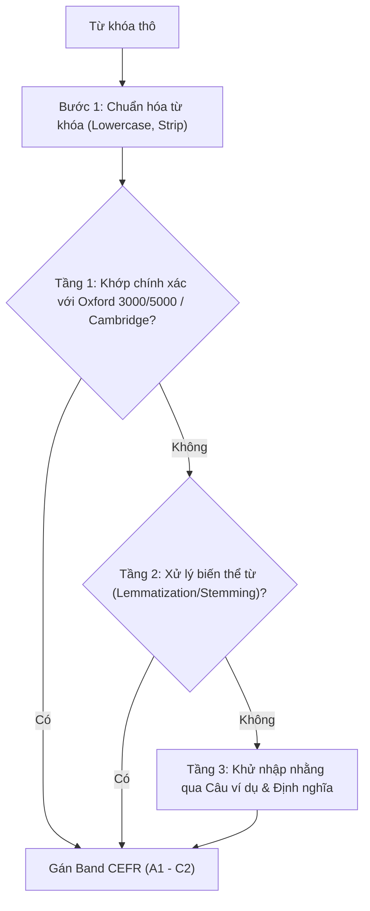

# CEFR & Topic Classifier (Động Cơ Phân Loại Từ Vựng & Khử Trùng Lặp)

Kỹ năng này chịu trách nhiệm chuẩn hóa dữ liệu từ vựng thô, đối soát với khung tham chiếu chuẩn quốc tế (CEFR / Oxford / Cambridge) và phân cụm theo các chủ đề học thuật lớn phục vụ việc học thi IELTS và tiếng Anh học thuật.

---

## 1. Chuẩn Hóa Từ Khóa (Keyword Normalization)

Trước khi thực hiện đối soát hoặc so sánh trùng lặp:
1. **Quy tắc Viết thường (Lowercase):**
   - Chuyển toàn bộ Keyword về chữ thường: `Cultural Exchange` $\rightarrow$ `cultural exchange`, `Depend (On)` $\rightarrow$ `depend (on)`.
   - **Ngoại lệ giữ viết hoa:** Từ viết tắt, tên riêng, danh hiệu học thuật (`AI`, `Mr.`, `Mrs.`, `Ms.`, `PhD`, `DNA`, `UNESCO`...).
2. **Loại bỏ Ký tự Nhiễu:**
   - Xóa bỏ khoảng trắng thừa đầu/cuối chuỗi (`strip()`).
   - Tách phần giới từ trong ngoặc đơn để lấy từ gốc tra cứu (ví dụ: `rely (on)` $\rightarrow$ từ gốc tra cứu là `rely`).

---

## 2. Thuật Toán Phân Cấp CEFR Đa Tầng (Multi-tier Matching)

- **Tầng 1 (Exact Match):** Đối soát trực tiếp với cơ sở dữ liệu Oxford 3000 (A1-B2), Oxford 5000 (B2-C1) và Cambridge English Vocabulary Profile.
- **Tầng 2 (Morphological / Lemmatization):**
  - Đưa từ về nguyên mẫu: danh từ số nhiều $\rightarrow$ số ít (`activities` $\rightarrow$ `activity`), động từ chia $\rightarrow$ nguyên thể (`depended` $\rightarrow$ `depend`), trạng từ $\rightarrow$ tính từ (`actively` $\rightarrow$ `active`).
  - Phân loại theo band của từ gốc và hiệu chỉnh +0.5 band nếu là biến thể học thuật nâng cao.
- **Tầng 3 (Contextual Disambiguation):**
  - Khi một từ có nhiều nghĩa thuộc các band khác nhau (ví dụ: `bank` mang nghĩa bờ sông vs ngân hàng tài chính): đọc nội dung câu trong trường `Example` và `Vietnamese` để xác định ngữ cảnh và gán band chính xác.

---

## 3. Hệ Thống 14 Chủ Đề Học Thuật Chuẩn (Topic Taxonomy)

Toàn bộ từ vựng được gom vào 14 nhóm chủ đề chính:

1. **`Environment` (Môi trường & Thiên nhiên):** Khí hậu, ô nhiễm, hệ sinh thái, động thực vật, tài nguyên thiên nhiên, năng lượng tái tạo.
2. **`Health & Medicine` (Sức khỏe & Y tế):** Bệnh tật, điều trị, dinh dưỡng thể chất, tâm lý học, giải phẫu, lối sống lành mạnh.
3. **`Science & Technology` (Khoa học & Công nghệ):** Trí tuệ nhân tạo, máy tính, vật lý, hàng không vũ trụ, kỹ thuật, đổi mới sáng tạo.
4. **`Education & Academic` (Giáo dục & Học thuật):** Trường học, đại học, nghiên cứu, phương pháp học tập, học vị, thi cử.
5. **`Society & Social Issues` (Xã hội & Cộng đồng):** Bình đẳng, văn hóa, nhập cư, nhân khẩu học, cộng đồng, phong tục tập quán.
6. **`Economy & Business` (Kinh tế & Kinh doanh):** Tài chính, thị trường, thương mại, đầu tư, việc làm, doanh nghiệp.
7. **`Daily Life & Lifestyle` (Đời sống Hằng ngày):** Gia đình, nhà cửa, sinh hoạt thường nhật, mua sắm, sở thích, mối quan hệ.
8. **`Arts & Media` (Nghệ thuật & Truyền thông):** Văn học, điện ảnh, âm nhạc, báo chí, mạng xã hội, hội họa, kiến trúc.
9. **`Travel & Transportation` (Du lịch & Giao thông):** Giao thông công cộng, định vị, tham quan, địa lý, cơ sở hạ tầng.
10. **`Law, Crime & Justice` (Pháp luật & Trật tự):** Hệ thống luật, tòa án, tội phạm, hình phạt, quyền con người.
11. **`People & Psychology` (Con người & Tâm lý):** Tính cách, cảm xúc, hành vi, tư duy, nhận thức xã hội.
12. **`Communication & Language` (Giao tiếp & Ngôn ngữ):** Thuyết trình, hùng biện, đàm phán, ngôn ngữ học, thảo luận.
13. **`Food & Agriculture` (Thực phẩm & Nông nghiệp):** Ẩm thực, canh tác, dinh dưỡng, chế biến, an toàn thực phẩm.
14. **`General Academic` (Thuật ngữ Học thuật Tổng quát):** Các từ nối logic, từ mang tính suy luận, mô tả dữ liệu biểu đồ, từ trừu tượng.

---

## 4. Cơ Chế Phát Hiện & Quản Lý Trùng Lặp (Deduplication Strategy)

- **Phát hiện:** Nhóm các thẻ theo `normalized_keyword`. Nếu một từ xuất hiện ở $\ge 2$ subdeck khác nhau (ví dụ: `competition` có mặt ở cả Books, Cambridge và Oxford):
  - Đánh dấu từ là `is_duplicate: true`.
  - Xác định **Thẻ chính (Primary Card):** Ưu tiên thẻ đã có lịch sử ôn tập cao nhất (`reps` lớn nhất) hoặc có nội dung câu ví dụ chi tiết nhất.
  - Các thẻ còn lại được đánh dấu là **Thẻ phụ (Duplicate Cards)**.
- **Hành động:**
  - Gán nhãn `#status::duplicate` cho tất cả các thẻ bị trùng lặp.
  - Gán nhãn chéo `#ref_deck::<subdeck_gốc>` để người dùng biết nguồn gốc ban đầu của từng thẻ.
  - Cung cấp tùy chọn trong báo cáo: Giữ nguyên hai thẻ riêng biệt hoặc gộp tiến độ vào thẻ chính.
