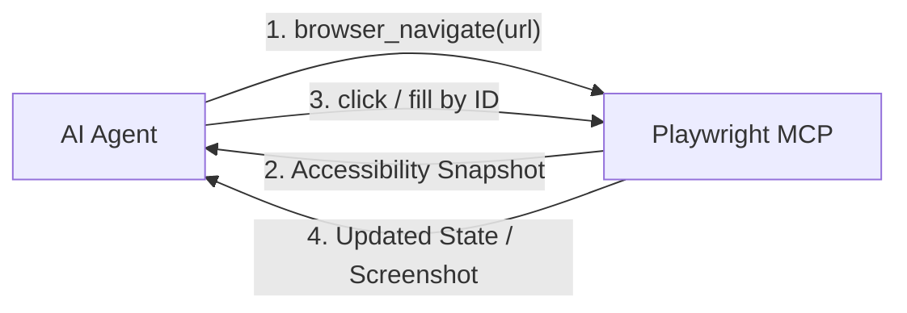

# Playwright MCP: On-Demand Browser Automation & E2E Testing

Bộ công cụ và hướng dẫn cấu hình **Playwright Model Context Protocol (MCP)** chính thức từ Microsoft Playwright ([playwright.dev/docs/getting-started-mcp](https://playwright.dev/docs/getting-started-mcp) / `@playwright/mcp@latest`).

Được thiết kế để **kích hoạt cục bộ theo nhu cầu từng dự án** (không cài vào Antigravity tổng) nhằm tiết kiệm tài nguyên và tối ưu hóa quy trình kiểm thử E2E.

---

## 1. NGUYÊN TẮC HOẠT ĐỘNG (Core Concept)

Thay vì yêu cầu mô hình thị giác (Vision LLM) chụp và phân tích từng khung hình tốn kém, Playwright MCP sử dụng **Accessibility Tree Snapshots**:
1. **`browser_navigate`:** Mở trang web tại URL đích.
2. **Accessibility Snapshot:** Trả về cây phần tử ngữ nghĩa (Semantic DOM tree) có đánh số tham chiếu (Role, Name, Element ID).
3. **Action Execution:** AI Agent gọi các công cụ `click`, `type`, `fill`, `hover` dựa trên ID tham chiếu chính xác 100%.



---

## 2. HƯỚNG DẪN KÍCH HOẠT CỤC BỘ CHO DỰ ÁN CON (Project Setup)

Khi một dự án web con cần kiểm thử trình duyệt, chọn một trong các cách sau:

### Cách 1: Thêm vào file cấu hình `.mcp.json` của dự án (Khuyến nghị)
Tạo tệp `.mcp.json` (hoặc `.cursor/mcp.json` / `claude_desktop_config.json`) tại thư mục gốc của dự án con:

```json
{
  "mcpServers": {
    "playwright": {
      "command": "npx",
      "args": ["@playwright/mcp@latest", "--headless"]
    }
  }
}
```

### Cách 2: Chạy trực tiếp qua lệnh dòng lệnh (CLI / Subshell)
```bash
# Chạy ở chế độ Headless (chạy ngầm, không mở cửa sổ trình duyệt):
npx @playwright/mcp@latest --headless

# Chạy ở chế độ Headed (mở cửa sổ trình duyệt để quan sát trực tiếp):
npx @playwright/mcp@latest

# Chỉ định trình duyệt (chromium, firefox, webkit, msedge):
npx @playwright/mcp@latest --browser=firefox

# Giả lập thiết bị di động (Mobile emulation):
npx @playwright/mcp@latest --device="iPhone 15"
```

---

## 3. DANH MỤC CÔNG CỤ CỐT LÕI (Core Tools)

| Tên Công Cụ | Chức Năng Chính | Tham Số Đầu Vào |
| :--- | :--- | :--- |
| `browser_navigate` | Mở trang web tại URL chỉ định | `url` (string) |
| `browser_click` | Nhấp chuột vào phần tử theo ID/selector | `element_id` hoặc `selector` |
| `browser_type` | Gõ ký tự bàn phím vào ô nhập liệu | `element_id`, `text` |
| `browser_fill` | Điền nhanh toàn bộ giá trị vào ô input/textarea | `element_id`, `value` |
| `browser_hover` | Rê chuột lên phần tử (kích hoạt menu hover/tooltip) | `element_id` |
| `browser_screenshot` | Chụp ảnh màn hình lưu vào tệp hoặc trả về base64 | `name`, `full_page` (boolean) |
| `browser_evaluate` | Thực thi đoạn mã JavaScript trong ngữ cảnh trang | `script` (string) |
| `browser_press_key` | Nhấn các phím đặc biệt (`Enter`, `Escape`, `Tab`, `ArrowDown`) | `key` (string) |

📄 Tra cứu chi tiết tại: [references/tool-reference.md](file:///d:/AntigravityProject/ThietLapAntigravity/AI_Skills/testing/playwright-mcp/references/tool-reference.md)

---

## 4. CÁC BIỂU MẪU & KỊCH BẢN THAM KHẢO (Templates & Recipes)

* 📄 [templates/mcp-project-config.json](file:///d:/AntigravityProject/ThietLapAntigravity/AI_Skills/testing/playwright-mcp/templates/mcp-project-config.json): Mẫu cấu hình `.mcp.json` cho dự án con.
* 📄 [templates/playwright.config.ts](file:///d:/AntigravityProject/ThietLapAntigravity/AI_Skills/testing/playwright-mcp/templates/playwright.config.ts): Mẫu cấu hình Playwright Test tự động.
* 📄 [references/e2e-testing-recipes.md](file:///d:/AntigravityProject/ThietLapAntigravity/AI_Skills/testing/playwright-mcp/references/e2e-testing-recipes.md): Kịch bản mẫu kiểm thử Đăng nhập, Điền biểu mẫu và Visual Regression.
