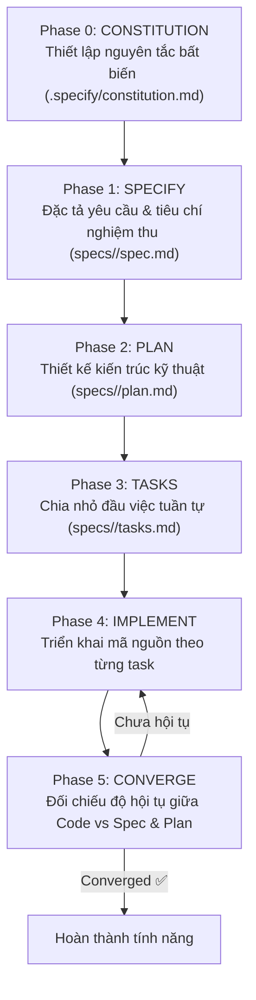

# Spec-Driven Development (SDD) — GitHub Spec Kit

> **"Define what to build before building it — with any AI coding agent."**  
> Specifications don't serve code; code serves specifications. When specifications and implementation plans generate code, there is no gap—only transformation.

---

## 1. NGUYÊN TẮC CỐT LÕI (Core Philosophy)

1. **Specifications as the Lingua Franca:** Đặc tả (PRD / Spec) là nguồn chân lý số 1 (Source of Truth). Mã nguồn chỉ là bản thể hiện kỹ thuật của đặc tả.
2. **Executable Specifications:** Đặc tả phải đủ chính xác, rõ ràng, không mơ hồ để có thể chuyển hóa thành kiến trúc và mã nguồn hoạt động được.
3. **Continuous Convergence (Hội tụ liên tục):** Kiểm tra liên tục xem mã nguồn thực tế có bám sát Spec và Plan hay không (`converge`), tránh lệch hướng kiến trúc.
4. **Root-Cause Evidence for Bugs:** Sửa lỗi luôn dựa trên bằng chứng và chẩn đoán nguyên nhân gốc rễ (**Assess → Fix → Test**), không chữa triệu chứng tạm thời.

---

## 2. QUY TRÌNH 6 PHA PHÁT TRIỂN TÍNH NĂNG (SDD Feature Lifecycle)

---

### Pha 0: Constitution (Hiến pháp dự án)
* **Mục đích:** Thiết lập các nguyên tắc bất biến về kiến trúc, bảo mật, tiêu chuẩn code và công nghệ một lần duy nhất cho toàn bộ kho mã nguồn.
* **Vị trí lưu:** `.specify/constitution.md` (tham khảo mẫu tại [templates/constitution-template.md](file:///d:/AntigravityProject/ThietLapAntigravity/AI_Skills/_shared/spec-driven-development/templates/constitution-template.md)).
* **Quy tắc:** Mọi tính năng sau này đều phải tuân thủ nghiêm ngặt Hiến pháp dự án.

### Pha 1: Specify (Đặc tả yêu cầu / PRD)
* **Mục đích:** Làm rõ bài toán từ góc nhìn người dùng/nghiệp vụ.
* **Vị trí lưu:** `specs/<feature-name>/spec.md` (tham khảo mẫu tại [templates/spec-template.md](file:///d:/AntigravityProject/ThietLapAntigravity/AI_Skills/_shared/spec-driven-development/templates/spec-template.md)).
* **Nội dung chính:**
  * User Scenarios & User Stories.
  * Functional Requirements (Yêu cầu chức năng) & Non-functional Requirements (Hiệu năng, bảo mật, khả năng mở rộng).
  * Out of Scope (Những gì KHÔNG làm).
  * Acceptance Criteria (Tiêu chí nghiệm thu chi tiết, rõ ràng).

### Pha 2: Plan (Kế hoạch kỹ thuật & Kiến trúc)
* **Mục đích:** Chuyển hóa PRD thành thiết kế kỹ thuật cụ thể.
* **Vị trí lưu:** `specs/<feature-name>/plan.md` (tham khảo mẫu tại [templates/plan-template.md](file:///d:/AntigravityProject/ThietLapAntigravity/AI_Skills/_shared/spec-driven-development/templates/plan-template.md)).
* **Nội dung chính:**
  * System Architecture & Component Boundaries.
  * Data Models & Schema Changes.
  * API Contracts / Endpoints.
  * Technical Decisions & Rationale (Lý do chọn thư viện/giải pháp).

### Pha 3: Tasks (Chia nhỏ đầu việc)
* **Mục đích:** Tách kế hoạch thành các task nhỏ độc lập, có thứ tự thực thi rõ ràng.
* **Vị trí lưu:** `specs/<feature-name>/tasks.md` (tham khảo mẫu tại [templates/tasks-template.md](file:///d:/AntigravityProject/ThietLapAntigravity/AI_Skills/_shared/spec-driven-development/templates/tasks-template.md)).
* **Quy chuẩn:** Mỗi task phải có mô tả rõ ràng, tệp cần sửa/tạo mới, và cách thức kiểm thử (verification command).

### Pha 4: Implement (Thực thi mã nguồn)
* **Mục đích:** AI Agent triển khai code theo đúng từng task trong `tasks.md`.
* **Kỷ luật:** Không nhảy cóc, không viết code nằm ngoài phạm vi của task hiện tại. Đánh dấu `[x]` vào task đã hoàn thành sau khi kiểm thử thành công.

### Pha 5: Converge (Đối chiếu độ hội tụ)
* **Mục đích:** Rà soát toàn diện mã nguồn vừa viết đối chiếu với `spec.md` và `plan.md`.
* **Tiêu chí kiểm tra:**
  1. Tất cả Acceptance Criteria trong `spec.md` đã có code/test đáp ứng chưa?
  2. Kiến trúc code thực tế có bị lệch so với `plan.md` không?
  3. Có phát sinh code thừa thãi / vi phạm Hiến pháp (`constitution.md`) không?
* **Kết quả:** Báo cáo trạng thái **"Converged"** khi đáp ứng 100%, hoặc liệt kê các điểm thiếu sót để quay lại Pha 4 khắc phục.

---

## 3. CÁC QUY TRÌNH PHỤ TRỢ (Specialized Workflows)

### A. Quy trình Sửa lỗi có bằng chứng (Bug Fix Workflow)
📄 Xem chi tiết tại: [workflows/bug-workflow.md](file:///d:/AntigravityProject/ThietLapAntigravity/AI_Skills/_shared/spec-driven-development/workflows/bug-workflow.md)
* **Bước 1 (Assess):** Thu thập log, tái hiện lỗi, xác định nguyên nhân gốc rễ (Root Cause), không chữa triệu chứng tạm thời.
* **Bước 2 (Fix):** Sửa lỗi tập trung tại đúng điểm gốc (shared function/guard) để vá cho tất cả các caller liên quan.
* **Bước 3 (Test):** Viết test case hồi quy (regression test) chứng minh lỗi đã được giải quyết hoàn toàn.

### B. Quy trình Đánh giá Ý tưởng (Idea Assessment Workflow)
📄 Xem chi tiết tại: [workflows/idea-assessment.md](file:///d:/AntigravityProject/ThietLapAntigravity/AI_Skills/_shared/spec-driven-development/workflows/idea-assessment.md)
* Quy trình 5 bước: **Intake → Research → Define → Shape → Decide**.
* Đưa ra quyết định rõ ràng: **Go** (bàn giao sang Pha 1 Specify), **Needs Clarification** (cần thêm dữ liệu), hoặc **Kill** (hủy bỏ ý tưởng không khả thi/không hiệu quả).

---

## 4. BIỂU MẪU MẪU (Templates Directory)

* 📄 [templates/constitution-template.md](file:///d:/AntigravityProject/ThietLapAntigravity/AI_Skills/_shared/spec-driven-development/templates/constitution-template.md): Mẫu Hiến pháp dự án.
* 📄 [templates/spec-template.md](file:///d:/AntigravityProject/ThietLapAntigravity/AI_Skills/_shared/spec-driven-development/templates/spec-template.md): Mẫu đặc tả yêu cầu chức năng (PRD).
* 📄 [templates/plan-template.md](file:///d:/AntigravityProject/ThietLapAntigravity/AI_Skills/_shared/spec-driven-development/templates/plan-template.md): Mẫu kế hoạch kiến trúc kỹ thuật.
* 📄 [templates/tasks-template.md](file:///d:/AntigravityProject/ThietLapAntigravity/AI_Skills/_shared/spec-driven-development/templates/tasks-template.md): Mẫu phân rã đầu việc.
* 📄 [templates/checklist-template.md](file:///d:/AntigravityProject/ThietLapAntigravity/AI_Skills/_shared/spec-driven-development/templates/checklist-template.md): Bảng kiểm tra chất lượng nghiệm thu.
