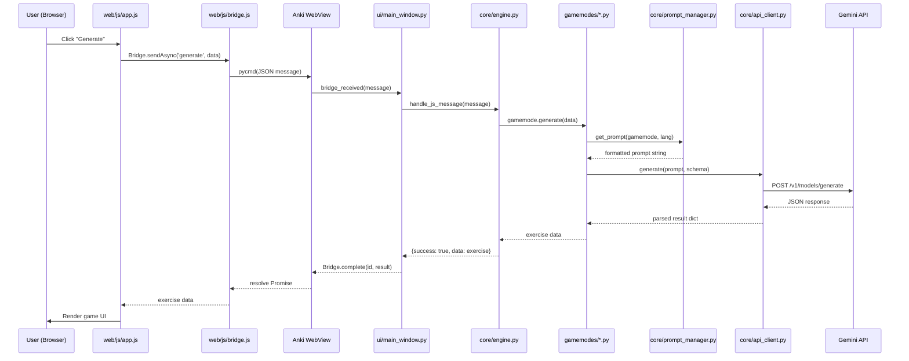

# AI Learning Hub — Architecture Guide

This document describes the internal architecture of AI Learning Hub for developers and researchers who want to understand, extend, or modify the add-on.

## System Overview

AI Learning Hub has a single production engine (Python/Anki) and a web SPA frontend (vanilla JS). There is no Node.js or separate backend server required.

```
Anki Application
    └── AI Learning Hub (Python add-on)
            ├── Qt UI Layer    (__init__.py → ui/main_window.py)
            ├── Engine Layer   (core/engine.py)
            ├── Gamemode Layer (gamemodes/*.py)
            ├── AI Layer       (core/api_client.py → Gemini API)
            └── Web SPA        (web/ — served via Anki WebView)
```

## Data Flow

The complete request lifecycle from user interaction to AI response:



## Component Responsibilities

### `__init__.py` — Anki Entry Point
- Registers the add-on with Anki (menu item, hooks)
- Creates the Qt main window (`ui/main_window.py`)
- Initializes `AIEngine` on profile load

### `core/engine.py` — Bridge Message Router (776 lines)
- **Section 1**: Module-level helpers (`clean_json_response`, `normalize_answer`, `sanitize_html`)
- **Section 2**: `AIEngine` class — manages GeminiClient, PromptManager, gamemode cache
- **Section 3**: `handle_js_message()` — dispatch table routing 15+ bridge actions
- **Section 4**: Generate & game handlers (`_handle_generate`, `_handle_check_answer`, `_handle_ai_grade`)
- **Section 5**: Settings & UI handlers (`_handle_save_settings`, `_handle_get_ui_strings`, etc.)

### `core/api_client.py` — Gemini Client
- Manages multiple API keys with automatic rotation
- Rate limiting and retry logic
- Structured output via Pydantic schemas
- Returns safe result objects (never raises exceptions to callers)

### `core/prompt_manager.py` — Prompt Loading
- Loads prompt templates from `prompts/{learn_lang}/{gamemode}.txt`
- Falls back to `prompts/en/{gamemode}.txt` for unsupported languages
- Substitutes `{learn_lang}`, `{ui_lang}`, `{level}`, `{topic}` placeholders
- Converts ISO language codes to full names for AI comprehension

### `core/schema_registry.py` — Pydantic Schemas (416 lines)
- Defines the exact JSON structure each gamemode's AI response must follow
- Used for Gemini structured output (enforces response format)
- Each gamemode has a dedicated Pydantic model

### `gamemodes/*.py` — Game Logic

| File | Class | Key Method | Schema |
|---|---|---|---|
| `fill_blank.py` | `FillBlank` | `generate()` | `FillBlankExercise` |
| `cloze.py` | `Cloze` | `generate()` | `ClozeExercise` |
| `translation.py` | `Translation` | `generate()`, `check_answer()` | `TranslationExercise` |
| `word_unscramble.py` | `WordUnscramble` | `generate()`, `check_answer()` | `UnscrambleExercise` |
| `word_matching.py` | `WordMatching` | `generate()` | `MatchingExercise` |
| `story_generator.py` | `StoryGenerator` | `generate()` | `StoryExercise` |
| `sentence_transform.py` | `SentenceTransform` | `generate()`, `check_answer()` | `SentenceTransformExercise` |
| `taboo.py` | `Taboo` | `generate()`, `check_answer()` | `TabooExercise` |

### `web/js/app.js` — SPA Frontend (3280 lines)

All wrapped in a single IIFE `const App = (() => { ... })()`. Organized by section:

| Section | Lines (approx) | Contents |
|---|---|---|
| 1. State & Preferences | 1–175 | `loadPrefs`, `savePrefs`, `loadHistory`, `loadMatchingStats` |
| 2. Core Utilities | 175–310 | `t()`, `esc()`, `showStatus`, `disposeCurrentGame`, `getWeakWords` |
| 3. Routing & Shell | 310–395 | `home()`, `game()`, `render()`, `shell()`, `setBusy()`, `nav()` |
| 4. Source & Settings | 395–830 | `source()`, `controls()`, `bindSource()`, `loadModels()`, `loadFields()` |
| 5. Generate & History | 830–1130 | `generate()`, `preview()`, `sample()`, `addHistory()`, `normalizeExercise()` |
| 6. Fill Blank & Cloze | 1130–1630 | `renderFillBlank()`, `renderCloze()`, history detail branches |
| 7. Word Matching | 1630–2130 | `renderMatching()`, board engine (`initBoard`, `refillSlots`, `evaluateMatch`) |
| 8. Unscramble | 2130–2450 | `renderUnscrambleAll()`, `updateUnscrambleCardDOM()`, drag-drop handlers |
| 9. Story / Translation / Transform / Taboo | 2450–3190 | `renderStory()`, `renderTranslation()`, `renderSentenceTransform()`, `renderTaboo()` |
| 10. Startup & Entry | 3190–3280 | `startApp()`, `render()`, `testKeys()` |

### `web/js/bridge.js` — RPC Bridge (151 lines)
- Promise-based wrapper around Anki's `pycmd()` function
- Queues requests while bridge initializes
- Supports AbortSignal and timeout
- Browser dev mode falls back to `fetch POST /api/bridge`

## Language System

The add-on uses a **two-axis language model**:

```
Axis 1: learn_lang  — The language being studied (en, ja, ko, fr, ...)
Axis 2: ui_lang     — The language of the interface (en, vi)
```

These are completely independent. A user can have `ui_lang=vi` (Vietnamese interface) while studying Japanese (`learn_lang=ja`).

**Prompt generation** uses `learn_lang` to select the prompt template directory and fills `{learn_lang}` / `{ui_lang}` placeholders. The AI receives both axes and generates:
- Exercise content in `learn_lang`
- Explanations and feedback in `ui_lang`

## Adding a New Game Mode

1. **Create** `gamemodes/my_game.py` implementing `generate()` and optionally `check_answer()`
2. **Add** a Pydantic schema to `core/schema_registry.py`
3. **Create** prompt templates in `prompts/en/my_game.txt`
4. **Register** in `gamemodes/__init__.py`
5. **Register** in `core/engine.py` GAME_LIMITS dict
6. **Add** render function in `web/js/app.js` Section 9
7. **Add** game card to home screen in `home()` function

## Adding a New UI Language

1. Copy `lang/en.json` to `lang/{new_lang}.json`
2. Translate all values (keep keys unchanged)
3. Add the language code to `uiLanguages` in `lang/languages.json`

## Adding a New Learning Language

1. Add an entry to `learnLanguages` in `lang/languages.json`:
   ```json
   { "code": "th", "native": "ภาษาไทย", "names": { "en": "Thai", "vi": "Tiếng Thái" } }
   ```
2. Optionally create `prompts/th/` with specialized templates; otherwise falls back to `prompts/en/`
3. No other code changes needed.

## Key Design Decisions

| Decision | Rationale |
|---|---|
| Single IIFE for app.js | Anki WebView does not support ES Modules; no bundler for frontend |
| Pydantic schemas for AI output | Ensures structured, validated responses from Gemini |
| Prompt fallback to `en/` | New languages work immediately without writing new prompts |
| Two-axis language model | UI lang and learning lang are truly independent user preferences |
| Python as single source of truth | No TypeScript server mirrors Python logic; Anki is the only runtime |
