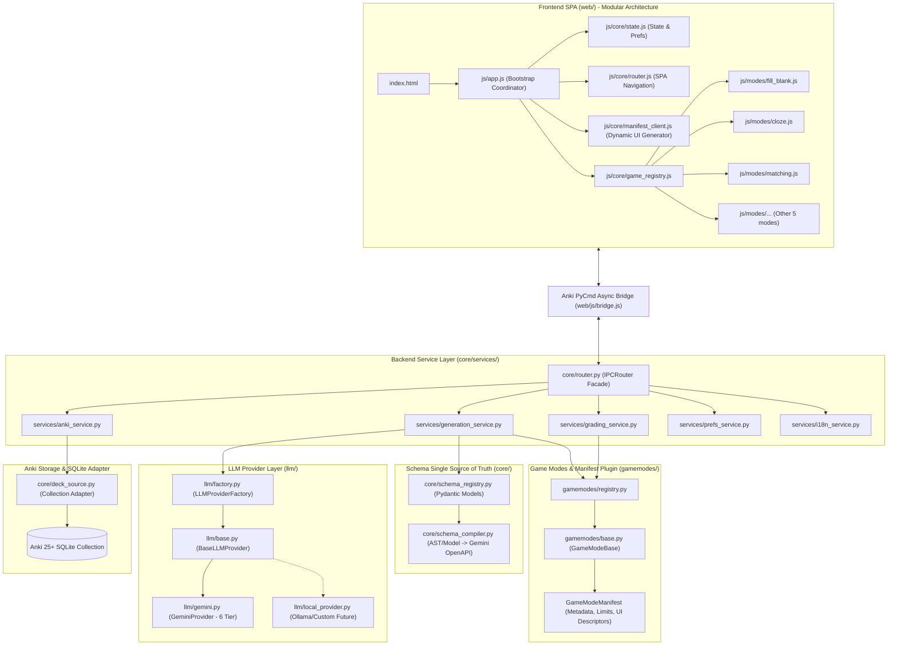
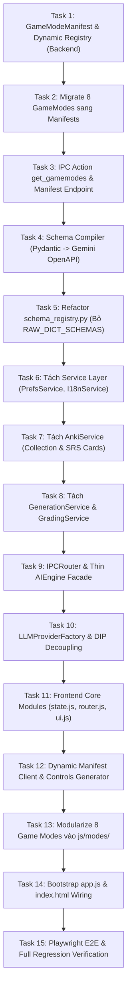

# Kế hoạch Kỹ thuật: Nâng Cấp Khả Năng Mở Rộng & Modular Hóa Kiến Trúc (Architectural Extensibility & Modularization)

- **Mã kế hoạch:** `PLAN-003`
- **Tên tệp:** `003-architectural-extensibility-and-modularization.md`
- **Dự án:** `Anki AI Learning Hub`
- **Phiên bản:** `3.0.0 (Architectural Blueprint & Modular Implementation)`
- **Trạng thái:** **COMPLETED ✅** (Đã triển khai hoàn tất 5 Phase, 15/15 Tasks và xác minh thị giác bằng Playwright)
- **Kế hoạch trước:** [`PLAN-002` (002-optimization-and-bottleneck-resolution.md)](file:///d:/AntigravityProject/Anki_AI_Learning_Hub/plans/complete/002-optimization-and-bottleneck-resolution.md)
- **Baseline kiểm thử hoàn tất:** 83/83 Python Unit Tests PASS (100%), Playwright E2E PASS, Node Bootstrap PASS.

---

## 1. Đánh Giá Hiện Trạng & Xác Thực Điểm Nghẽn Kiến Trúc

Sau khi đối chiếu phân tích của người dùng với mã nguồn thực tế:

| Hiện trạng & Điểm nghẽn | Đánh giá thực tế trong mã nguồn | Giải pháp kiến trúc PLAN-003 |
| :--- | :--- | :--- |
| **1. Thêm Game Mode mới sửa 7-8 files** | **Đúng thực tế**. Cần sửa `constants.py` (`GAME_LIMITS`), `engine.py` (duplicate limits), `gamemodes/__init__.py`, `schema_registry.py` (Pydantic + RAW_DICT), `app.js` (`games` array, `controls()`, `play()`, `request()`, `renderX()`). Vi phạm nghiêm trọng nguyên lý OCP (Open/Closed). | **Phase 1: Game Manifest & Dynamic Registry**. Mỗi Game Mode là một Self-describing Plugin công bố đầy đủ metadata, controls descriptor và limits. Frontend sinh UI động. |
| **2. `core/engine.py` là God Object** | **Đúng thực tế**. `engine.py` dài 717+ dòng với 37 hàm gom chung: IPC Router, Quản lý Key/Settings, Điều phối LLM, Gọi Anki Collection, Chấm điểm đa hình, Quản lý UI Lang. | **Phase 2: Bóc tách Engine thành Service Layer**. Tách thành `IPCRouter` mỏng và 5 Services chuyên biệt: `GenerationService`, `GradingService`, `AnkiService`, `PrefsService`, `I18nService`. |
| **3. Schema Duplication Pydantic vs Dict** | **Đúng thực tế**. `schema_registry.py` chứa 140 dòng Pydantic models và 198 dòng `RAW_DICT_SCHEMAS` duplicate hoàn toàn cấu trúc JSON Schema cho Gemini API. | **Phase 3: Schema Single Source of Truth**. Xây dựng `SchemaCompiler` biên dịch trực tiếp từ Pydantic/dataclass sang dialect OpenAPI của Gemini, xóa bỏ bảo trì thủ công 2 đầu. |
| **4. Frontend `app.js` đơn khối khổng lồ** | **Đúng thực tế**. `web/js/app.js` có độ dài 3.572 dòng chứa toàn bộ routing, state, preferences, UI shells, timer, audio và logic render của 8 game modes. | **Phase 4: Modular hóa Frontend**. Chia thành kiến trúc module vanilla không cần build tool: `js/core/`, `js/modes/`, `js/ui/` với client-side `GameModeRegistry`. |
| **5. Phụ thuộc chặt vào `GeminiClient`** | **Đúng thực tế**. Mặc dù `BaseLLMProvider` đã có tại `llm/base.py`, `engine.py` và `gamemodes/base.py` vẫn import trực tiếp concrete class `GeminiClient`. | **Phase 5: LLM Provider Factory**. Áp dụng Dependency Inversion (DIP) và Factory Pattern, cho phép cấu hình và chuyển đổi provider linh hoạt (Gemini, Local/Ollama, OpenRouter). |

---

## 2. Tích Hợp Các Kỹ Năng (Skills Integration Matrix)

| Kỹ năng (Skill) | Mục tiêu áp dụng cụ thể trong PLAN-003 | Giai đoạn phụ trách |
| :--- | :--- | :--- |
| **`spec-driven-development`** | Thiết lập Hợp đồng dữ liệu bất biến (Manifest Contract, IPC Contract, Schema Compilation Contract) và Acceptance Criteria cụ thể. | Xuyên suốt Phase 1 - 5 |
| **`brainstorming`** | Phân tích ưu/nhược điểm các giải pháp kiến trúc (ES Modules vs Script Tags, Dynamic Schema Compilation vs Pre-compiled Cache). | Thiết kế & Phê duyệt |
| **`task-generation`** | Phân rã 5 Phase thành 15 Tasks độc lập, tuần tự, mỗi task <100 LOC để triển khai phẫu thuật an toàn, không gây side-effect. | Lập kế hoạch & Triển khai |
| **`system-programming`** | Thiết kế Service Layer, IPC Router Facade, Thread Safety với `mw.taskman.run_on_main`, Dependency Inversion cho LLM Provider. | Phase 2, Phase 3, Phase 5 |
| **`coding-discipline`** | Tuân thủ Single Responsibility Principle, Atomic edits, bảo toàn 100% backward compatibility cho 79 unit tests có sẵn. | Xuyên suốt Phase 1 - 5 |
| **`ui-ux-pro-max`** | Thiết kế Dynamic Form Renderer cho Game Controls (Glassmorphism UI, Responsive Grid, A11y tokens). | Phase 1 & Phase 4 |
| **`playwright-mcp`** | Tự động hóa kiểm thử đầu cuối (E2E) trên trình duyệt mô phỏng, chụp ảnh xác minh thị giác (Visual Proof) cho cả 8 game modes. | Nghiệm thu & Hậu kiểm |

---

## 3. Bản Thiết Kế Kiến Trúc Chi Tiết (Architectural Blueprint)



---

## 4. Chi Tiết Kỹ Thuật 5 Phase Triển Khai

### Phase 1: Game Manifest & Dynamic Registry (Plugin Extensibility)
- **Mục tiêu:** Biến mỗi Game Mode thành một module tự mô tả (Self-Describing Plugin). Thêm game mode mới chỉ cần tạo 1 file duy nhất trong `gamemodes/` mà không phải sửa `constants.py`, `engine.py`, hay mảng `games` cứng ở frontend.
- **Hợp đồng `GameModeManifest`:**
  ```python
  @dataclass(frozen=True)
  class GameControlField:
      id: str                      # Ví dụ: "num_blanks", "focus"
      type: str                    # "select" | "number" | "text"
      label_key: str               # I18n key cho label
      default: Any
      options: List[Dict[str, str]] = field(default_factory=list) # [{"value": "voice", "label_key": "controls.voice"}]

  @dataclass(frozen=True)
  class GameModeManifest:
      id: str                      # "fill_blank", "cloze", ...
      icon: str                    # Emoji hoặc SVG token
      title_key: str               # I18n key
      default_title: str
      desc_key: str
      default_desc: str
      min_items: int = 1
      max_items: int = 10
      default_items: int = 5
      requires_anki_cards: bool = False
      custom_controls: List[GameControlField] = field(default_factory=list)
  ```
- **Dynamic Backend Registry (`gamemodes/registry.py`):**
  - Tự động phát hiện hoặc đăng ký tập trung các GameMode.
  - Cung cấp `list_manifests()` trả về JSON schema để gửi qua IPC action `get_gamemodes`.
  - Dynamic `get_limits(mode_name)` thay thế cho dict cứng `GAME_LIMITS` trong `constants.py` và `engine.py` (vẫn export `GAME_LIMITS` tương thích ngược).
- **Frontend Dynamic Form Generator (`js/core/manifest_client.js`):**
  - Khi ứng dụng khởi động, gọi `get_gamemodes` từ backend.
  - Tự động sinh danh sách Game Cards trên màn hình chính và bộ lọc cấu hình (Controls Panel: select số câu, mức độ khó, chủ đề, custom controls) dựa trên Manifest mà không có bất kỳ câu lệnh `if (id === 'cloze')` hay `switch (id)` nào.

---

### Phase 2: Bóc Tách Engine Thành Service Layer (God Object Refactoring)
- **Mục tiêu:** Phân rã `core/engine.py` (717 dòng, 37 phương thức) thành kiến trúc phân tầng rõ ràng, giảm độ phức tạp chu trình (Cyclomatic Complexity).
- **Cấu trúc mới:**
  1. `core/router.py`: Lớp `IPCRouter` tiếp nhận chuỗi JSON từ `handle_js_message`, giải mã an toàn, định tuyến đến Service Handler tương ứng, tự động bọc response envelope chuẩn `_result(data, error, message)` và bắt ngoại lệ tập trung.
  2. `services/generation_service.py`: Chịu trách nhiệm về luồng sinh bài: hủy tác vụ (`cancel_event`), báo cáo tiến độ (`_send_progress`), lấy prompt từ `PromptManager`, gọi LLM Provider và validate schema.
  3. `services/grading_service.py`: Điều phối chấm điểm: `check_answer` (chấm offline đa hình), `ai_grade` (chấm tự luận bằng LLM), `get_hint` (gợi ý phân tầng).
  4. `services/anki_service.py`: Toàn bộ tương tác dữ liệu Anki: `list_decks`, `get_source_models`, `get_source_fields`, `sample_vocab_pairs`, `save_to_anki` (sử dụng `core/deck_source.py` an toàn luồng chính và giới hạn số lượng hydrate).
  5. `services/prefs_service.py`: Quản lý cấu hình `SettingsManager`, kiểm tra key, test xoay vòng key và lưu preferences nguyên tử (`prefs.json`).
  6. `services/i18n_service.py`: Quản lý chuẩn hóa ngôn ngữ giao diện và ngôn ngữ học tập.
  7. `core/engine.py`: Đóng vai trò Facade mỏng (`AIEngine`), khởi tạo các services và chuyển tiếp yêu cầu đến `IPCRouter`. Giữ nguyên 100% public APIs để các file hook của Anki và test suite không bị đứt gãy.

---

### Phase 3: Schema Single Source of Truth (DRY Schema Architecture)
- **Mục tiêu:** Xóa bỏ hoàn toàn 198 dòng lặp lại của `RAW_DICT_SCHEMAS` trong `core/schema_registry.py`. Chỉ định nghĩa schema một lần duy nhất.
- **Giải pháp `core/schema_compiler.py`:**
  - Xây dựng bộ biên dịch `compile_model_to_gemini_schema(pydantic_model) -> dict`.
  - Hỗ trợ đầy đủ các thuộc tính của OpenAPI 3.0 subset theo yêu cầu của Google Gemini API:
    - `type`: `OBJECT`, `ARRAY`, `STRING`, `INTEGER`, `BOOLEAN`
    - `properties`, `items`, `required`
    - Xử lý mượt mà các trường hợp đệ quy, `Optional[T]`, `List[T]`, các schema lồng nhau (`nested models`).
  - **Fallback an toàn khi môi trường thiếu Pydantic:** Sử dụng bộ sinh schema từ `typing.NamedTuple` hoặc `dataclass` chuẩn Python, hoặc export schema cache tự động lúc build/test, cam kết không duy trì 2 bản thủ công.

---

### Phase 4: Modular Hóa Frontend Vanilla JS (Zero-Build Frontend Architecture)
- **Mục tiêu:** Phân rã `web/js/app.js` (3.572 dòng) thành các module đơn trách nhiệm, dễ bảo trì và mở rộng, nhưng giữ nguyên khả năng nạp trực tiếp trong Anki QWebEngineView mà không bắt buộc người dùng chạy Node bundler phức tạp ở runtime.
- **Cấu trúc phân rã:**
  - `web/js/core/state.js`: Lưu trữ trạng thái reactive tập trung (`state`), logic lưu/đọc `localStorage` và `prefs` với debounce.
  - `web/js/core/router.js`: Điều hướng màn hình (`home`, `game`, `history`, `matching-stats`).
  - `web/js/core/ui.js`: Render các thành phần dùng chung (Header, Footer, Glassmorphic Modals, Status Banner, Toasts).
  - `web/js/core/game_registry.js`: Client-side Game Registry cho phép các mini game đăng ký handler (`registerMode(id, modeDefinition)`).
  - `web/js/modes/`: Tách từng game mode thành file riêng biệt:
    - `fill_blank.js`, `cloze.js`, `translation.js`, `unscramble.js`, `matching.js`, `story.js`, `sentence_transform.js`, `taboo.js`.
    - Mỗi file chứa hàm `render(container, exerciseData)` và `bindEvents(container)`.
  - `web/js/app.js`: Entry point tinh gọn (~150 dòng) làm nhiệm vụ bootstrap, nạp manifests từ backend và khởi động router.
  - `web/index.html`: Cập nhật thẻ script theo thứ tự phụ thuộc chính xác, hoặc sử dụng cơ chế nạp module linh hoạt.

---

### Phase 5: LLM Provider Factory & Dynamic Backend Support
- **Mục tiêu:** Hiện thực hóa hoàn chỉnh nguyên lý Đảo ngược Phụ thuộc (DIP) cho tầng LLM.
- **Thiết kế:**
  - `llm/factory.py`:
    ```python
    class LLMProviderFactory:
        _registry = {}

        @classmethod
        def register(cls, name: str, provider_cls: Type[BaseLLMProvider]):
            cls._registry[name] = provider_cls

        @classmethod
        def create(cls, name: str, settings: dict, cancel_event: threading.Event) -> BaseLLMProvider:
            provider_cls = cls._registry.get(name)
            if not provider_cls:
                raise ValueError(f"Unknown LLM provider: {name}")
            return provider_cls.from_settings(settings, cancel_event)
    ```
  - Mặc định đăng ký `"gemini"` -> `GeminiProvider` (với 6-tier fallback engine, key rotation và backoff hiện có).
  - `gamemodes/base.py`: Chuyển type hint từ `GeminiClient` sang `BaseLLMProvider`.
  - Chuẩn bị sẵn abstraction interface để tương lai có thể cắm thêm `LocalOllamaProvider` hoặc `OpenRouterProvider` mà không cần sửa bất kỳ dòng nào trong `core/engine.py` hay `gamemodes/`.

---

## 5. Danh Sách Nhiệm Vụ Tuần Tự (Decomposed Task Breakdown - SDD)

Mỗi nhiệm vụ được thiết kế tuân thủ nghiêm ngặt quy tắc: Phạm vi tập trung, <100 LOC thay đổi mỗi bước, có tiêu chí nghiệm thu rõ ràng và bảo toàn kiểm thử.



| Task | Tên nhiệm vụ | Mô tả & Files tác động | Kỹ năng chính | Tiêu chí nghiệm thu (Acceptance Criteria) |
| :--- | :--- | :--- | :--- | :--- |
| **Task 1** | Manifest Core & Registry | Tạo `gamemodes/manifest.py` & `gamemodes/registry.py`. Định nghĩa dataclass `GameModeManifest` và class `GameModeRegistry`. | `system-programming`, `spec-driven-development` | Khởi tạo registry rỗng, thêm/lấy manifest hoạt động chuẩn, unit test PASS. |
| **Task 2** | Migrate 8 GameModes sang Manifest | Khai báo `manifest` trên cả 8 class trong `gamemodes/`. Đăng ký tự động vào `REGISTRY`. | `coding-discipline` | `gamemodes.list_gamemodes()` trả đủ 8 modes kèm manifest metadata đầy đủ. |
| **Task 3** | IPC Action `get_gamemodes` | Bổ sung action `get_gamemodes` vào engine trả về danh sách manifests cho frontend. Tương thích ngược `GAME_LIMITS`. | `system-programming` | Gọi `handle_js_message('{"action":"get_gamemodes"}')` trả về JSON envelope chứa 8 manifests. |
| **Task 4** | Schema Compiler | Xây dựng `core/schema_compiler.py` biên dịch Pydantic V2/V1 sang OpenAPI JSON Schema dialect của Gemini. | `system-programming`, `coding-discipline` | Compiler sinh đúng 100% cấu trúc tương đương với dict hiện tại cho cả 8 game modes. |
| **Task 5** | Refactor `schema_registry.py` | Loại bỏ 198 dòng `RAW_DICT_SCHEMAS`. `get_schema()` gọi trực tiếp `SchemaCompiler`. | `coding-discipline` | Bộ test `test_schema_registry.py` tiếp tục PASS 100% mà không còn dict schema thủ công. |
| **Task 6** | Tách `PrefsService` & `I18nService` | Tạo `core/services/prefs_service.py` và `core/services/i18n_service.py`, chuyển logic settings, test key, ngôn ngữ từ engine sang. | `system-programming` | Kiểm thử `test_settings.py` và `test_languages.py` PASS 100%. |
| **Task 7** | Tách `AnkiService` | Tạo `core/services/anki_service.py` đóng gói toàn bộ hàm `list_decks`, `get_source_models`, `sample_vocab_pairs`, `save_to_anki`. | `system-programming` | Tương tác Anki collection chạy qua AnkiService an toàn trên main thread, test SQLite PASS. |
| **Task 8** | Tách `GenerationService` & `GradingService` | Tạo `core/services/generation_service.py` và `core/services/grading_service.py` quản lý sinh bài, hủy bài và chấm điểm. | `system-programming` | Tách biệt hoàn toàn luồng AI generation và grading khỏi file engine chính. |
| **Task 9** | `IPCRouter` & `AIEngine` Facade | Tạo `core/router.py` định tuyến request tập trung. `AIEngine` trở thành facade ngắn gọn (<150 dòng) điều phối các services. | `system-programming` | Toàn bộ 79 backend unit tests PASS hoàn toàn không sửa đổi chữ ký gọi test. |
| **Task 10** | `LLMProviderFactory` | Tạo `llm/factory.py`. Decouple `GeminiClient` khỏi `gamemodes/base.py` sang `BaseLLMProvider`. | `system-programming`, `coding-discipline` | Engine khởi tạo provider qua Factory; mở đường cắm provider mới dễ dàng. |
| **Task 11** | Frontend Core Modules | Tạo `web/js/core/state.js`, `web/js/core/router.js`, `web/js/core/ui.js`. Tách state & navigation ra khỏi `app.js`. | `ui-ux-pro-max`, `coding-discipline` | Node bootstrap test nạp được state và router mà không gặp lỗi cú pháp. |
| **Task 12** | Dynamic Manifest Client | Tạo `web/js/core/manifest_client.js` gọi `get_gamemodes` và sinh giao diện Controls Panel động. | `ui-ux-pro-max`, `web-accessibility-wcag` | Thêm game mode mới ở backend tự động hiện nút bấm và config UI tương ứng trên frontend. |
| **Task 13** | Modularize 8 Game Modes | Tách 8 mini-games vào `web/js/modes/fill_blank.js`, `cloze.js`, `matching.js`, ... Mỗi mode tự quản lý render & click handlers. | `ui-ux-pro-max`, `coding-discipline` | Mỗi mode file <300 dòng, đăng ký qua `GameRegistry.registerMode()`. |
| **Task 14** | Bootstrap `app.js` & `index.html` | Thu gọn `web/js/app.js` thành coordinator (<150 dòng). Cập nhật `index.html` tải các script theo trình tự chuẩn. | `coding-discipline` | Ứng dụng khởi động mượt mà, spinner biến mất, hiển thị đủ 8 thẻ bài trên Hub. |
| **Task 15** | Playwright E2E & Xác minh Thị giác | Chạy kiểm thử Playwright tự động, chụp ảnh màn hình xác minh thị giác (Visual Proof) cho cả 8 chế độ chơi và Settings. | `playwright-mcp` | Chụp ảnh bằng chứng 8 game modes vận hành trơn tru, không có lỗi console hay crash giao diện. |

---

## 6. Kế Hoạch Xác Minh & Kiểm Thử Toàn Diện (Verification Plan)

### A. Kiểm Thử Tự Động (Automated Testing)
1. **Python Unit Tests:**
   - Lệnh: `python -B -m unittest discover -s tests -p "test_*.py" -v`
   - Tiêu chí: **100% PASS** toàn bộ bài test hiện có (79/79 tests) + bổ sung test mới cho `SchemaCompiler`, `GameModeRegistry`, `IPCRouter`, `LLMProviderFactory`.
2. **Frontend Bootstrap Smoke Test:**
   - Lệnh: `node tests/test_web_bootstrap.js`
   - Tiêu chí: **PASS**, DOM giả lập nạp thành công các modules, không có lỗi undefined hay cú pháp.

### B. Kiểm Thử Giao Diện Trình Duyệt & Bằng Chứng Thị Giác (Visual Verification with Playwright)
1. **Chạy Playwright E2E Suite:**
   - Lệnh: `python -B -m unittest tests/test_playwright_e2e.py -v`
2. **Tự động chụp ảnh bằng chứng (Artifact Screenshots):**
   - Chụp ảnh màn hình Dashboard chính (8 cards sinh động từ dynamic manifests).
   - Chụp ảnh màn hình Config Panel của Fill in the Blank, Cloze, Word Matching.
   - Chụp ảnh màn hình gameplay thực tế của ít nhất 3 game modes.
   - Lưu trữ toàn bộ ảnh vào Artifacts Directory để người dùng kiểm chứng trực tiếp.

### C. Quy Trình Đồng Bộ Kiểm Thử Anki (Theo Quy Định AGENTS.md)
- **Tuyệt đối KHÔNG đóng gói** add-on (`build_addon.py`) trừ khi người dùng yêu cầu trực tiếp.
- Sử dụng script đồng bộ sạch: `python scripts/sync_to_anki.py` sao chép trực tiếp vào `%APPDATA%\Anki2\addons21\AI_Learning_Hub\`.

---

## 7. Đề Xuất Điều Phối & Phân Vai (/teamwork-preview & /boost)

Nếu người dùng kích hoạt `/teamwork-preview` hoặc `/boost`, công việc sẽ được phân chia cho các Subagents chuyên trách:
1. **Agent 1 (System Architect - Backend):** Đảm nhiệm Phase 1 (GameManifest), Phase 2 (Engine Services & Router), Phase 3 (SchemaCompiler), Phase 5 (LLMFactory).
2. **Agent 2 (Frontend Specialist - Vanilla Modular):** Đảm nhiệm Phase 4 (Modularize `app.js` thành `js/core/` và `js/modes/`, tạo dynamic form controls).
3. **Agent 3 (QA & Visual Verifier - Playwright):** Đảm nhiệm bộ test hồi quy, chạy Playwright chụp ảnh bằng chứng thị giác cho 8 game modes.

---

> [!IMPORTANT]
> **GATE APPROVAL**: Toàn bộ nội dung trên là Kế hoạch Kỹ thuật (PLAN-003). Hiện tại **chưa có bất kỳ dòng mã nguồn nào bị thay đổi**.
> Vui lòng xem xét và phản hồi để chúng tôi tiến hành triển khai khi bạn đồng ý!
