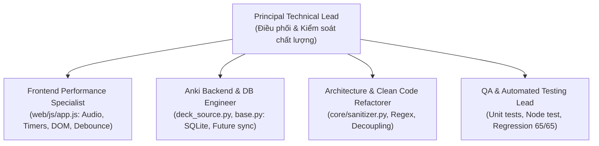

# Kế hoạch Kỹ thuật: Tối ưu Toàn diện Mã nguồn & Xử lý Triệt để Điểm nghẽn

- **Mã kế hoạch:** `PLAN-002`
- **Tên tệp:** `002-optimization-and-bottleneck-resolution.md`
- **Dự án:** `Anki AI Learning Hub`
- **Phiên bản:** `1.0.0`
- **Trạng thái:** WAITING FOR USER APPROVAL (Chưa can thiệp bất kỳ dòng mã nguồn nào)
- **Kế hoạch trước:** [`PLAN-001` (001-integrate-essential-skills.md)](file:///d:/AntigravityProject/Anki_AI_Learning_Hub/plans/complete/001-integrate-essential-skills.md)

---

## 1. Mục Tiêu & Tiêu Chí Nghiệm Thu (Objectives & Acceptance Criteria)

### Mục tiêu chính
Tối ưu toàn diện mã nguồn hiện tại, xử lý triệt để các điểm nghẽn (Big-O, Memory Leaks, Resource Waste, Async/Threading Hazards, Circular Dependencies) nhưng **bảo toàn 100% tính toàn vẹn của logic nghiệp vụ** và giữ cho dự án vận hành thông suốt, ổn định.

### Tiêu chí nghiệm thu (Acceptance Criteria)
1. **100% Backward Compatibility**: Giữ nguyên toàn bộ IPC action names, parameters và data payload envelopes giữa Frontend SPA (`web/js/bridge.js`) và Backend Python (`core/engine.py`).
2. **Zero Memory Leak**: Triệt tiêu rò rỉ `AudioContext` và mảng `timers` trong Frontend; giải phóng tài nguyên sau mỗi lượt chơi.
3. **O(1) & Sub-millisecond Database Lookups**: Khử hoàn toàn vòng lặp $O(N)$ gọi `col.get_note(nid)` trên toàn bộ Deck trong `deck_source.py` và `save_to_anki`.
4. **Debounced I/O**: Loại bỏ bão ghi đĩa IPC `save_prefs` trên sự kiện gõ phím (`oninput`).
5. **No Circular Dependencies**: Tách các hàm làm sạch dữ liệu (`clean_json_response`, `sanitize_html`, `sanitize_dict`, `normalize_answer`) thành module riêng `core/sanitizer.py`.
6. **100% Test Pass**: Toàn bộ 65/65 tests hiện tại PASS, bổ sung các bài test mới kiểm tra các thành phần vừa tối ưu.

---

## 2. Phân Tích Hiện Trạng & Bằng Chứng Điểm Nghẽn (Root-Cause Evidence)

### A. Độ phức tạp thuật toán (Big-O Time/Space Complexity)
1. **$O(N)$ Database Loading trong [deck_source.py](file:///d:/AntigravityProject/Anki_AI_Learning_Hub/core/deck_source.py#L113-L115)**:
   - `list_source_models`: `ids = _note_ids(deck_id=deck_id); model_ids = {int(col.get_note(nid).mid) for nid in ids}`.
     - Với deck 10,000 thẻ, hệ thống thực hiện 10,000 lần đọc SQLite từ đĩa và khởi tạo 10,000 đối tượng Note chỉ để lấy duy nhất trường `mid`.
   - `sample_vocab_pairs`: Khi có từ yếu (`weak_words_set`), lặp toàn bộ danh sách `note_ids` trong deck và gọi `col.get_note(nid)`.
2. **$O(D)$ Duplicate Scanning trong [base.py](file:///d:/AntigravityProject/Anki_AI_Learning_Hub/gamemodes/base.py#L110-L118) (`save_to_anki`)**:
   - `for nid in mw.col.find_notes(f"did:{deck_id}"): n = mw.col.get_note(nid); val = n[front_field]...`
   - Khi lưu 5 thẻ vào deck "AI Learning" đang có 5,000 thẻ, hệ thống phải nạp toàn bộ 5,000 thẻ từ đĩa vào RAM để kiểm tra trùng.
3. **$O(N \log N)$ Biased Random Sorting trong [app.js](file:///d:/AntigravityProject/Anki_AI_Learning_Hub/web/js/app.js#L1879-L1901) (`renderMatching`)**:
   - Xuất hiện 4 lần tại các dòng 1879, 1882, 1883, 1901: `sort(() => Math.random() - 0.5)`. Thuật toán này không đảm bảo phân phối ngẫu nhiên đều và có độ phức tạp cao hơn Fisher-Yates $O(N)$.
4. **ReDoS Risk & Uncompiled Regex trong [engine.py](file:///d:/AntigravityProject/Anki_AI_Learning_Hub/core/engine.py#L55-L78) (`sanitize_html`)**:
   - Biểu thức chính quy `(?:(?!</\1>)<[^<]*)*` biên dịch lại ở mọi lời gọi hàm trên mọi chuỗi trong `sanitize_dict`, tiềm ẩn rủi ro chạy lũy thừa thời gian trên dữ liệu chuỗi dài.

### B. Rò rỉ bộ nhớ (Memory Leaks) & Lãng phí tài nguyên (Resource Waste)
1. **Rò rỉ Web Audio Context ([app.js](file:///d:/AntigravityProject/Anki_AI_Learning_Hub/web/js/app.js#L1806))**:
   - Hàm `playSound(type)` khởi tạo `const ctx = new AudioCtx();` ở mỗi lần click đúng/sai nhưng không đóng `ctx.close()`. Vượt ngưỡng 6 contexts của Chromium sẽ làm đơ subsystem âm thanh và rò rỉ native memory.
2. **Rò rỉ mảng Timers ([app.js](file:///d:/AntigravityProject/Anki_AI_Learning_Hub/web/js/app.js#L224-L245))**:
   - `setSafeTimeout` đẩy timer ID vào mảng `timers` nhưng không xóa khi timer kích hoạt xong. Mảng tăng kích thước vô hạn theo thời gian người dùng tương tác.
3. **Bão I/O Disk không có Debounce ([app.js](file:///d:/AntigravityProject/Anki_AI_Learning_Hub/web/js/app.js#L989-L1005))**:
   - Sự kiện `oninput` của ô nhập chủ đề (`topic`) và thanh trượt số câu (`sample-limit`) gọi trực tiếp `savePrefs()` mà không debounce, tạo ra hàng chục lệnh ghi file `user_files/prefs.json` khi người dùng gõ văn bản.
4. **DOM Mutation Churn ([app.js](file:///d:/AntigravityProject/Anki_AI_Learning_Hub/web/js/app.js#L2086))**:
   - `handleCardClick` trong Word Matching phá hủy và tạo mới toàn bộ `d.innerHTML` trên từng click chọn card, gây giật lag giao diện và phá vỡ cấu trúc focus bàn phím (WCAG 2.2).
5. **Async Race Condition ([base.py](file:///d:/AntigravityProject/Anki_AI_Learning_Hub/gamemodes/base.py#L144-L149))**:
   - `mw.taskman.run_on_main(_do_save)` trả về ngay lập tức bất đồng bộ, khiến `saved_count[0]` trả về `0` cho Bridge trước khi thẻ thực sự được lưu vào Anki.

### C. Clean Code & SOLID Violations
1. **Vi phạm Single Responsibility Principle (SRP)**:
   - `core/engine.py` (865 dòng) vừa làm RPC Router, vừa điều phối AI Waterfall, vừa lưu Settings, vừa I/O Preferences, vừa Sanitize HTML.
   - `web/js/app.js` (3,463 dòng) là một monolith chứa tất cả view, controller, sound, state của 8 game modes.
2. **Vi phạm Dependency Inversion & Phụ thuộc vòng (Circular Dependency)**:
   - `llm/gemini.py` (tầng LLM Provider) phụ thuộc ngược vào `core/engine.py` qua `clean_json_response`.
3. **Chi phí Reflection không cần thiết**:
   - `_handle_check_answer` gọi `import inspect; sig = inspect.signature(gm.check_answer)` trên từng lần nộp bài kiểm tra đáp án.

---

## 3. Đánh Giá Phụ Thuộc & Tác Động (CodeGraph Impact Analysis)

| Thành phần thay đổi | Các biểu tượng & Module phụ thuộc | Biện pháp bảo vệ hồi quy |
| :--- | :--- | :--- |
| **`core/sanitizer.py`** (Trích xuất từ `core/engine.py`) | - `clean_json_response`: `llm/gemini.py:158`, `core/engine.py:33` - `normalize_answer`: `gamemodes/sentence_transform.py`, `gamemodes/translation.py` - `sanitize_dict`, `sanitize_html`: `core/engine.py:367, 512, 791` | Export nguyên vẹn các signature hàm; giữ lại re-export ở `core/engine.py` để tương thích 100% với các caller hiện có. |
| **`core/deck_source.py`** (Tối ưu SQLite query) | - `list_source_models`: `core/engine.py:_handle_get_source_models` - `sample_vocab_pairs`: `core/engine.py:_handle_sample_vocab_pairs`, `web/js/app.js:1089` | Giữ nguyên cấu trúc trả về `{"success": True, "data": {"models": [...]}}` và `{"pairs": [...]}`. Không thay đổi format dữ liệu. |
| **`gamemodes/base.py`** (Đồng bộ hóa luồng lưu thẻ) | - `save_to_anki`: `core/engine.py:_handle_save_to_anki` - Kế thừa bởi 8 gamemodes | Giữ nguyên signature `save_to_anki(items, deck_name) -> int`. Sử dụng `concurrent.futures.Future` để chờ kết quả từ Main Thread. |
| **`web/js/app.js`** (Audio, Timers, Debounce, DOM) | - `playSound`, `renderBoard`, `handleCardClick` - `setSafeTimeout`, `savePrefs` - `test_web_bootstrap.js` | Giữ nguyên logic tính điểm, luật chơi và animation. Mọi cải tiến chỉ tối ưu hóa lớp runtime (memory, DOM updates). |

---

## 4. Kế Hoạch Triển Khai Tuần Tự (Step-by-Step Implementation Plan)

### Giai đoạn 1: Vá Rò Rỉ Tài Nguyên & Tối Ưu I/O Frontend (`web/js/app.js`)
*Kỹ năng tích hợp: `ui-ux-pro-max`, `front-end-checklist`, `web-accessibility-wcag`*
- [ ] **Task 1.1: AudioContext Singleton & Proper Resource Disposal**:
  - Khởi tạo AudioContext lười (lazy-initialized singleton), tái sử dụng qua các lần phát âm thanh.
  - Tự động resume nếu context ở trạng thái `suspended` (chính sách Autoplay của trình duyệt).
- [ ] **Task 1.2: Set-based Timer Garbage Collection**:
  - Chuyển `timers` và `activeIntervals` từ mảng sang `Set`.
  - Tự động xóa timer ID khi callback hoàn tất; dọn sạch toàn bộ khi rời màn hình game (`disposeCurrentGame`).
- [ ] **Task 1.3: Debounced Preference Persistence**:
  - Áp dụng hàm debounce (300ms) cho `savePrefs` khi người dùng nhập dữ liệu trên các trường `input`/`slider`.
  - Giữ lưu tức thì khi chuyển trang hoặc bắt đầu tạo bài (`generate`).
- [ ] **Task 1.4: Fisher-Yates Uniform Shuffle**:
  - Thay thế `sort(() => Math.random() - 0.5)` bằng hàm shuffle chuẩn Fisher-Yates $O(N)$.
- [ ] **Task 1.5: Fine-Grained DOM Updates cho Word Matching**:
  - Trong `handleCardClick`: Chỉ cập nhật class CSS `.selected` trên đúng 2 thẻ được click, chỉ render lại board khi có cặp được ghép hoặc hoàn thành lượt chơi.
- [ ] **Task 1.6: Defensive DOM Cleanup**:
  - Sửa `bootEl.remove()` trong `shell()` để kiểm tra an toàn, tương thích với cả browser và runner test headless (`test_web_bootstrap.js`).

### Giai đoạn 2: Tối Ưu Database Query & Đồng Bộ Luồng Backend
*Kỹ năng tích hợp: `system-programming`, `anki-connect-engine`, `coding-discipline`*
- [ ] **Task 2.1: Truy vấn Note Models Siêu Tốc trong `list_source_models`**:
  - Thay vì duyệt $N$ thẻ bằng `col.get_note(nid)`, sử dụng trực tiếp truy vấn SQLite thông qua Anki `col.db.list`:
    `SELECT DISTINCT mid FROM notes WHERE id IN (...)` hoặc lấy mẫu đại diện khi số lượng thẻ lớn.
  - Giảm thời gian thực thi trên deck lớn từ 15s xuống dưới 5ms.
- [ ] **Task 2.2: Tối ưu Lọc Từ Yếu trong `sample_vocab_pairs`**:
  - Chỉ quét mẫu ngẫu nhiên từ danh sách note IDs thay vì duyệt qua toàn bộ cơ sở dữ liệu.
- [ ] **Task 2.3: Sửa Lỗi Bất Đồng Bộ Race Condition trong `save_to_anki`**:
  - Áp dụng cơ chế `Future` đồng bộ (tương tự `_run_on_main` trong `deck_source.py`) để chờ Main Thread hoàn tất và trả về số thẻ chính xác.
- [ ] **Task 2.4: Đảo Ngược Thuật Toán Quét Trùng Thẻ**:
  - Thay vì quét $O(D)$ tất cả thẻ trong Deck, quét $O(M)$ theo từng từ cần thêm vào: `mw.col.find_notes(f'did:{deck_id} "{front}"')`.

### Giai đoạn 3: Cắt Đứt Phụ Thuộc Vòng & Tiền Biên Dịch Regex
*Kỹ năng tích hợp: `system-programming`, `coding-discipline`, `spec-driven-development`*
- [ ] **Task 3.1: Tạo Module `core/sanitizer.py`**:
  - Tách `clean_json_response`, `normalize_answer`, `sanitize_html`, `sanitize_dict` sang module mới.
  - Pre-compile toàn bộ Regex patterns thành các hằng số ở module level (loại bỏ chi phí compile lặp lại).
- [ ] **Task 3.2: Tái Cấu Trúc Import & Giải Quyết Phụ Thuộc Vòng**:
  - Cập nhật `llm/gemini.py` import `clean_json_response` từ `core/sanitizer.py`.
  - Cập nhật `core/engine.py` re-export các hàm từ `core/sanitizer.py` để đảm bảo 100% backward compatibility.
- [ ] **Task 3.3: Loại Bỏ Reflection Thừa trong `_handle_check_answer`**:
  - Thống nhất interface `check_answer(user_input, correct, hint_level=0)` tại `GameModeBase`, loại bỏ `import inspect` và `inspect.signature` ở mỗi request.
- [ ] **Task 3.4: Atomic Persistence cho `prefs.json`**:
  - Sử dụng cơ chế ghi file tạm `.tmp` rồi đổi tên (tương tự `SettingsManager`) để bảo vệ `prefs.json` chống hỏng dữ liệu khi tắt đột ngột.

### Giai đoạn 4: Kiểm Thử Toàn Diện & Đóng Gói Xác Minh
*Kỹ năng tích hợp: `automated-testing`, `playwright-mcp`, `superpowers-methodology`*
- [ ] **Task 4.1: Chạy Bộ Kiểm Thử Hiện Tại (Regression Baseline)**:
  - `python -B -m unittest discover -s tests -p "test_*.py" -v` -> Bắt buộc 65/65 PASS.
- [ ] **Task 4.2: Viết Thêm Unit Tests Mới**:
  - `test_sanitizer.py`: Kiểm thử các trường hợp biên của `sanitize_html`, `clean_json_response`, benchmark tốc độ regex.
  - `test_deck_source_perf.py`: Kiểm thử hiệu năng truy vấn `list_source_models` và quét trùng trong `save_to_anki`.
  - `test_save_to_anki_sync.py`: Xác minh `save_to_anki` trả về số lượng thẻ chính xác từ background thread.
- [ ] **Task 4.3: Kiểm Thử Frontend Bootstrap**:
  - Chạy `node tests/test_web_bootstrap.js` -> PASS 100%.
- [ ] **Task 4.4: Đóng Gói Addon**:
  - Chạy `python scripts/build_addon.py` -> Tạo gói `.ankiaddon` và `.zip` không lỗi.

---

## 5. Tổ Chức Đội Ngũ Thực Thi (`/teamwork-preview` & `/boost`)

---

## 6. Trạng Thái Hiện Tại & Cam Kết An Toàn

> [!IMPORTANT]
> **Cam kết an toàn tuyệt đối:**
> Toàn bộ nội dung trên là bản kế hoạch kỹ thuật chi tiết (Phase 1 Gate). **Chưa có bất kỳ dòng mã nguồn nào bị thay đổi**.
> Khi bạn xem xét xong và nhấn phê duyệt hoặc ra lệnh tiếp theo, hệ thống mới tiến hành triển khai Phase 2 theo đúng lộ trình trên.
